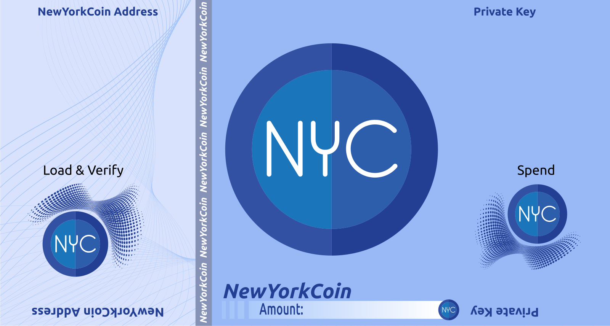
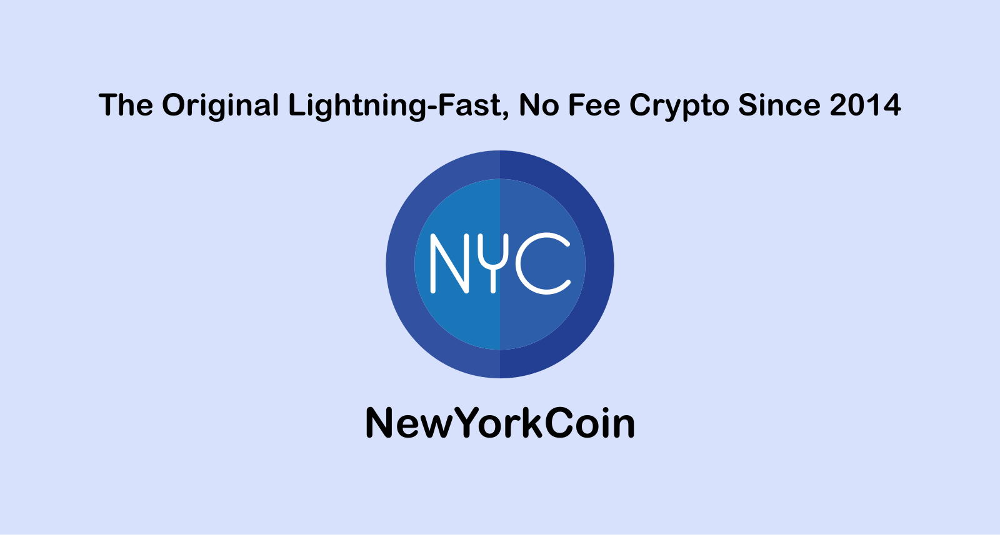

<!doctype html>
<html lang="en">

<head>
    <meta charset="utf-8">
    <meta name="viewport" content="width=device-width, initial-scale=1, shrink-to-fit=no">
    <meta name="description" content="">
    <meta name="author" content="">
    <meta name="viewport" content="width=device-width">
    <link rel="icon" href="images/favicon.ico">
    <link rel="apple-touch-icon" type="image/png" href="/build/apple-icon-57x57.png">
    <link rel="apple-touch-icon" type="image/png" sizes="72x72" href="/build/apple-icon-72x72.png">
    <link rel="apple-touch-icon" type="image/png" sizes="114x114" href="/build/apple-icon-114x114.png">
    <link rel="icon" type="image/png" href="/build/ms-icon-144x144.png">
    <title>NewYorkCoin Paper Wallet</title>
    <meta name="Description" content="A NewYorkCoin paper wallet is simply a public and private key printed together. It is an offline wallet, and is usually regarded as a type of “cold storage”.">
    <meta name="Keywords" content="cryptocurrency, wallet, NewYorkCoin, bitcoin, ethereum, dash, pivx">
    <meta property="og:title" content="NewYorkCoin Paper Wallet">
    <meta property="og:site_name" content="NewYorkCoin Cryptocurrency">
    <meta property="og:url" content="https://address.newyorkcoin.xyz/">
    <meta property="og:description" content="A NewYorkCoin paper wallet is simply a public and private key printed together. It is an offline wallet, and is usually regarded as a type of “cold storage”.">
    <meta property="og:type" content="website">
    <meta property="og:image" content="">
    <link href="css/bootstrap.min.css" rel="stylesheet">
    <link href="css/main.css" rel="stylesheet">
    <link href="css/print.css" rel="stylesheet" media="print">
</head>

<body>
    

        

            

                
            

            

                <h2 class="header-title">PAPER WALLET GENERATOR 1.4</h2>
            

        

        

            

                

                    <h2>What you need to know</h2>
                    

                        None of the generated keys are ever broadcast over the internet. It is recommended that you run it locally on your computer instead of generating the keys directly on the site. For additional security; you can run the generator and print the wallets using a secure offline environment and correctly wipe the environment and printer memory after use.
                    

                    

                        

                            

                                <a class="btn btn-main float-center" id="decrypt-tab-btn">Decrypt</a>
                                <a href="https://github.com/NewYorkCoinNYC/NYC_Paper_Wallet_Redux/releases" target="#" class="btn btn-alternate float-center">Download the Generator</a>
                            

                        

                    

                

            

            

                

                    

                        <label class="sr-only" for="number-option">How many wallets do you want to create?</label>
                        <select id="number-option" class="form-control mb-2 mr-sm-2">
                            <option value="1">1</option>
                            <option value="2">2</option>
                            <option value="3">3</option>
                            <option value="4">4</option>
                        </select>

                        <label class="sr-only" for="color-option">What color scheme would you like to use?</label>
                        <select id="color-option" class="form-control mb-2 mr-sm-2">
                            <option value="FULL_COLOR">Full Color</option>
                            <option value="BLACK_WHITE">Black & White</option>
                        </select>

                        <label class="sr-only" for="password">BIP38 Password (Optional)</label>
                        <input class="form-control form-input mb-2 mr-sm-2" id="password" placeholder="BIP38 Password (Optional)" maxlength="32" />

                        <label class="sr-only" for="generate">Generate Wallets</label>
                        <button id="generate" class="btn-main btn-print mb-2 mr-sm-2">Generate Wallets</button>

                        <label class="sr-only" for="print">Print</label>
                        <button id="print" class="btn-main btn-print mb-2 mr-sm-2">Print</button>

                        <label class="sr-only" for="reset">Reset</label>
                        <button id="reset" class="btn-main btn-print mb-2 mr-sm-2">Reset</button>
                    

                

            

            

                

                    
You can generate up to 4 which will fit onto 2 pieces of horizontal A4 paper.

                    
Ideally we suggest you print double sided. If you do not wish to, you can either print them seperately and affix them, or disregard the back sides entirely.

                    
Encrypting the private keys with a BIP38 password is recommended, but optional.

                    
Encrypting can take some time to complete, so please be patient.

                    
The password you set will be used for all generated wallets.

                    
This password can not be recovered, so do not lose it! It is recommended that you test decrypting the private key before sending coins to it to check nothing went wrong during encrytion.

                

            

            

                

                    <h3 class="paper-title" id="paper-title-0">Paper Wallet 1</h3>
                    

                        
                        

                        

                        

                        

                        

                        

                    

                    

                        <h4>Plain Text Address Info</h4>
                        <table>
                            <tr>
                                <td class="row-key">Public Key</td>
                                <td id="public-key-0"></td>
                            </tr>
                            <tr>
                                <td class="row-key">Private Key</td>
                                <td id="private-key-0"></td>
                            </tr>
                            <tr class="pt-encrypted" id="pt-encrypted-0">
                                <td class="row-key">Encrypted Key</td>
                                <td id="encrypted-key-0"></td>
                            </tr>
                            <tr class="pt-password" id="pt-password-0">
                                <td class="row-key">BIP38 Password</td>
                                <td id="password-0"></td>
                            </tr>
                        </table>
                    

                    <button class="btn-print no-print" id="decrypt-tab-0">Test Encryption</button>
                

                

                    <h3 class="paper-title" id="paper-title-1">Paper Wallet 2</h3>
                    

                        
                        

                        

                        

                        

                        

                        

                    

                    

                        <h4>Plain Text Address Info</h4>
                        <table>
                            <tr>
                                <td class="row-key">Public Key</td>
                                <td id="public-key-1"></td>
                            </tr>
                            <tr>
                                <td class="row-key">Private Key</td>
                                <td id="private-key-1"></td>
                            </tr>
                            <tr class="pt-encrypted" id="pt-encrypted-1">
                                <td class="row-key">Encrypted Key</td>
                                <td id="encrypted-key-1"></td>
                            </tr>
                            <tr class="pt-password" id="pt-password-1">
                                <td class="row-key">BIP38 Password</td>
                                <td id="password-1"></td>
                            </tr>
                        </table>
                    

                    <button class="btn-print no-print" id="decrypt-tab-1">Test Encryption</button>
                

                

                    

                    

                        

                            <h3 class="paper-title" id="paper-title-2">Paper Wallet 3</h3>
                            

                                
                                

                                

                                

                                

                                

                                

                            

                            

                                <h4>Plain Text Address Info</h4>
                                <table>
                                    <tr>
                                        <td class="row-key">Public Key</td>
                                        <td id="public-key-2"></td>
                                    </tr>
                                    <tr>
                                        <td class="row-key">Private Key</td>
                                        <td id="private-key-2"></td>
                                    </tr>
                                    <tr class="pt-encrypted" id="pt-encrypted-2">
                                        <td class="row-key">Encrypted Key</td>
                                        <td id="encrypted-key-2"></td>
                                    </tr>
                                    <tr class="pt-password" id="pt-password-2">
                                        <td class="row-key">BIP38 Password</td>
                                        <td id="password-2"></td>
                                    </tr>
                                </table>
                            

                            <button class="btn-print no-print" id="decrypt-tab-2">Test Encryption</button>
                        

                        

                            <h3 class="paper-title" id="paper-title-3">Paper Wallet 4</h3>
                            

                                
                                

                                

                                

                                

                                

                                

                            

                            

                                <h4>Plain Text Address Info</h4>
                                <table>
                                    <tr>
                                        <td class="row-key">Public Key</td>
                                        <td id="public-key-3"></td>
                                    </tr>
                                    <tr>
                                        <td class="row-key">Private Key</td>
                                        <td id="private-key-3"></td>
                                    </tr>
                                    <tr class="pt-encrypted" id="pt-encrypted-3">
                                        <td class="row-key">Encrypted Key</td>
                                        <td id="encrypted-key-3"></td>
                                    </tr>
                                    <tr class="pt-password" id="pt-password-3">
                                        <td class="row-key">BIP38 Password</td>
                                        <td id="password-3"></td>
                                    </tr>
                                </table>
                            

                            <button class="btn-print no-print" id="decrypt-tab-3">Test Encryption</button>
                        

                    

                

            

                

                    

                        
                    

                

                

                    

                        
                    

                

                

                    

                

                

                    

                        
                    

                

                

                    

                        
                    

                

            

        

        

            

                

                    <h2>Decrypt your private key</h2>
                    

                        If you have encrypted your private key with the BIP38 option, you can reveal the wallet import format private key here. If the encryption worked correctly, the private key here should match the private key displayed on the generator page.
                    

                    

                        

                            

                                <button class="btn btn-main float-center" id="generate-tab-btn">Generate</button>
                            

                        

                

            

            

                

                    Please enter your BIP38 password and the encrypted key to decrypt.
                

            

            

                

                    

                        <label class="sr-only" for="decrypt_password">BIP38 Password</label>
                        <input id="decrypt_password" class="form-control mb-2 mr-sm-2" placeholder="BIP38 Password" maxlength="32" />

                        <label class="sr-only" for="encrypted">Encrypted Key</label>
                        <input id="encrypted" class="form-control mb-2 mr-sm-2" placeholder="Encrypted Key" />

                        <label class="sr-only" for="decrypt">Decrypt</label>
                        <button id="decrypt" class="form-control mb-2 mr-sm-2 btn-print">Decrypt</button>

                        <label class="sr-only" for="reset_decrypt">Reset</label>
                        <button id="reset_decrypt" class="form-control mb-2 mr-sm-2 btn-print">Reset</button>
                    

                

            

            

                

                    

                        <h4>Decrypted Address Info</h4>
                        <table>
                            <tr>
                                <td class="row-key">Public Key</td>
                                <td id="public-key-d"></td>
                            </tr>
                            <tr>
                                <td class="row-key">Private Key</td>
                                <td id="private-key-d"></td>
                            </tr>
                            <tr>
                                <td class="row-key">Encrypted Key</td>
                                <td id="encrypted-key-d"></td>
                            </tr>
                            <tr>
                                <td class="row-key">BIP38 Password</td>
                                <td id="password-d"></td>
                            </tr>
                        </table>
                    

                

            

        

        

            

                
Brought to you by the <a href="https://cryptoloverbots.com" target="">CryptoLover705</a> 

                
By using this software you agree that NewYorkCoin is not responsible for any loss or damages caused by using this sofware and that you use it at your own risk.

            

        

    

    

        

            

                

                <h3 id="overlay-text">Decrypting Keys ...</h3>
                
Please be patient, this can take a while.

            
>
        

    

    
    
    
    
</body>

</html>
